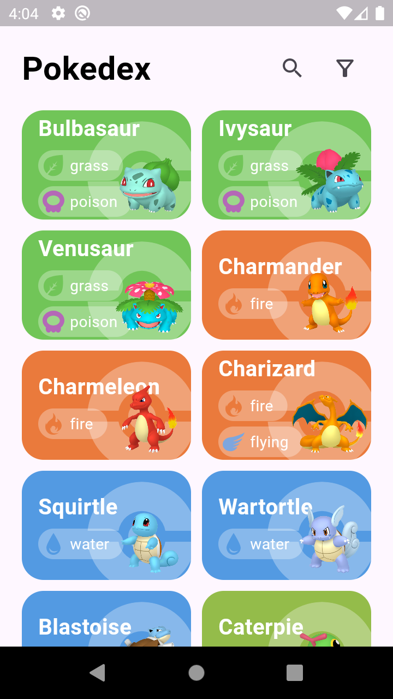
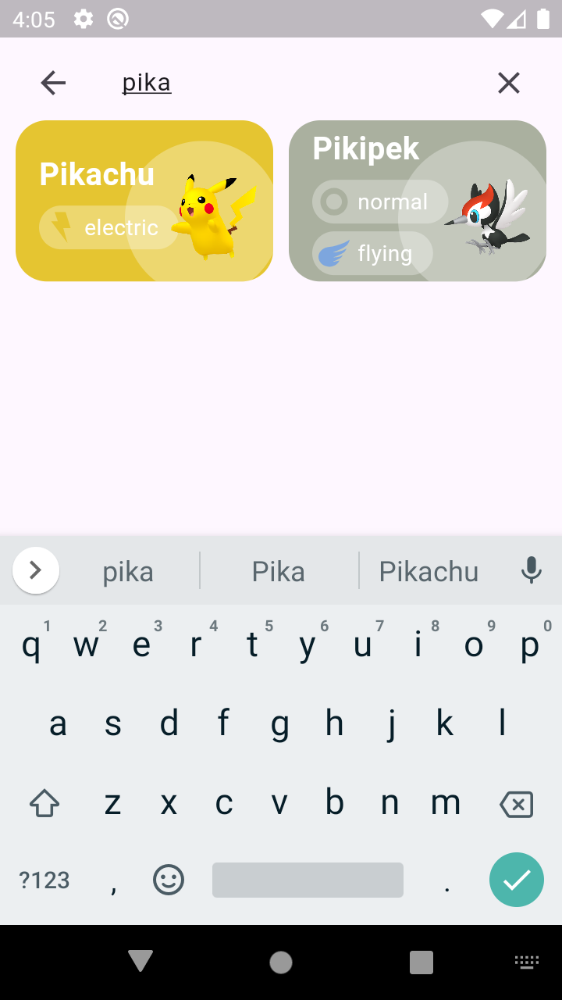
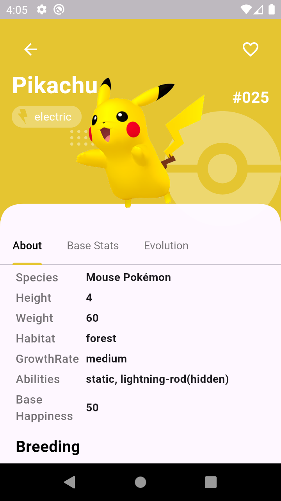
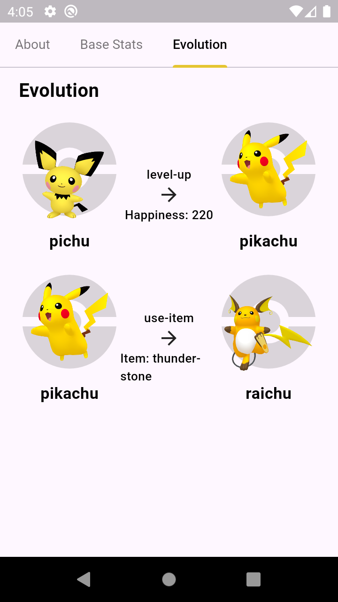
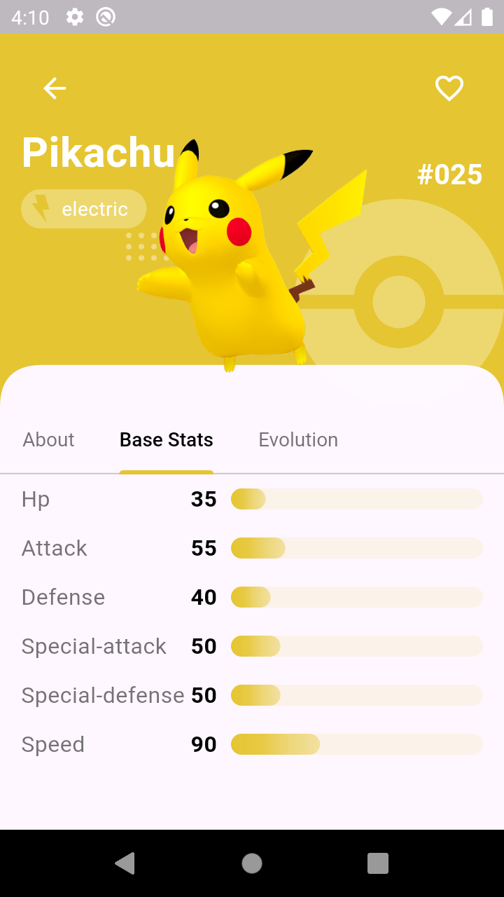
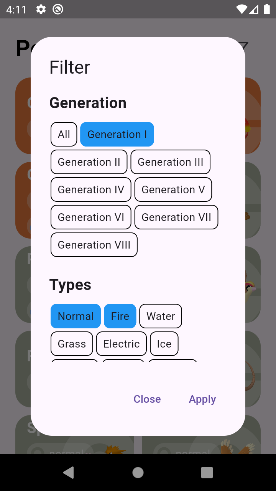
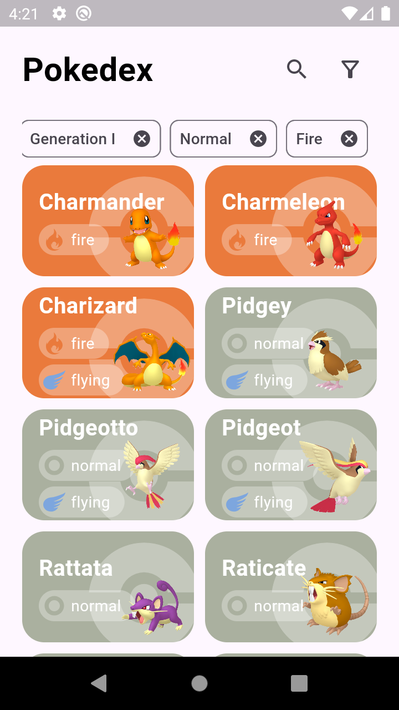

# Pokédex App

A comprehensive Pokédex app built with Flutter, using Supabase as the backend.
The app leverages Bloc for state management and follows Clean Architecture
principles, ensuring maintainable and scalable code. Users can search and filter
through Pokémon, view evolution chains, types, and other vital stats.

## Features

- **Search Functionality**: Quickly search for any Pokémon by name.
- **Filter Options**: Filter Pokémon by generation, type, legendary status, and
  more.
- **Detailed Pokémon Information**: View detailed stats, evolution chains, and
  other essential details for each Pokémon.
- **Responsive UI**: Designed for a seamless experience on both mobile and
  tablet devices.
- **State Management with Bloc**: Efficient and organized state management using
  the Bloc pattern.
- **Clean Architecture**: Separation of concerns into distinct layers
  (presentation, domain, and data) for easier testing and maintenance.
- **Pagination Support**: Efficiently handle large datasets with built-in
  pagination to load Pokémon data in chunks.

## Screenshots

### Home Screen



### Search Screen



### Pokémon Detail Screen

Here are three screenshots showing different views of the Pokémon Detail screen:

|                                                                    |                                                                    |                                                                    |
| ------------------------------------------------------------------ | ------------------------------------------------------------------ | ------------------------------------------------------------------ |
|  |  |  |

### Filter Screen

|  |  |
|-----------------|-----------------|
|  |  |

## Installation

### Prerequisites

- [Flutter](https://flutter.dev/docs/get-started/install) installed on your
  local machine.
- A Supabase project set up (see below for more details).

### Steps

1. **Clone the repository:**

   ```bash
   git clone https://github.com/sujanbimali9/pokedex.git
   cd pokedex
   ```

2. **Install dependencies:**

   ```bash
   flutter pub get
   ```

3. **Run the app:**

   ```bash
   flutter run
   ```

## Usage

1. **Search Pokémon:**
   - Use the search bar at the top of the screen to find Pokémon by name.

2. **Apply Filters:**
   - Access the filter options to narrow down your search by type, generation,
     legendary status, and more.

3. **View Pokémon Details:**
   - Tap on any Pokémon from the list to view detailed information, including
     stats, types, and evolution chain.

4. **Navigate Pages:**
   - Use pagination controls to navigate through large datasets efficiently,
     loading Pokémon data in chunks.

## Architecture Overview

The app follows the Clean Architecture approach, which separates the codebase
into three main layers:

1. **Presentation Layer**: Responsible for UI components and state management
   using Bloc.
2. **Domain Layer**: Contains business logic, including use cases and entities.
3. **Data Layer**: Handles data retrieval and storage, interacting with the
   Supabase backend.

This separation ensures that the app is modular, testable, and easy to maintain.

## Contributing

Contributions are welcome! Please fork the repository and submit a pull request
for any enhancements or bug fixes.

<!--
## License

This project is licensed under the MIT License - see the [LICENSE](LICENSE) file
for details. -->

## UI Design

The UI design of this app is inspired by the
[Pokedex App](https://dribbble.com/shots/6540871-Pokedex-App) design on
Dribbble.
